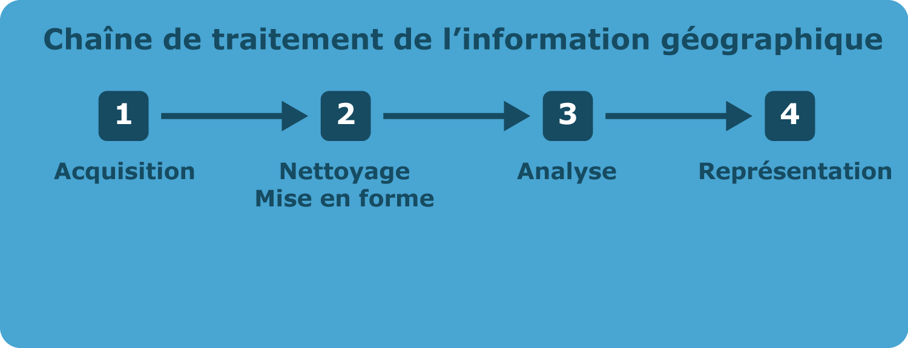
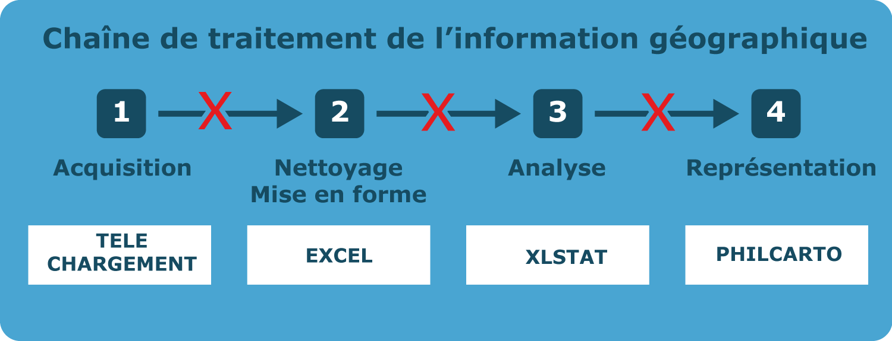
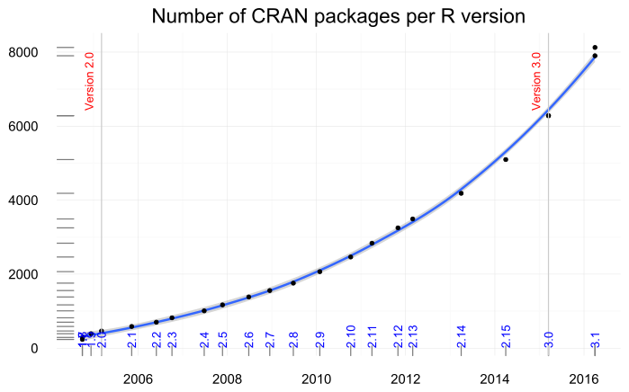
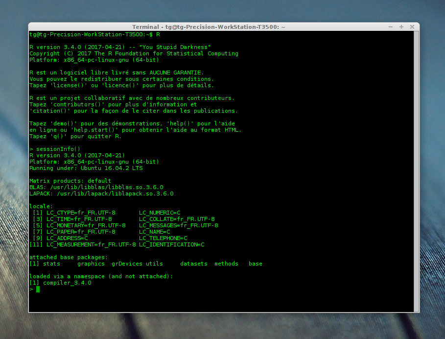
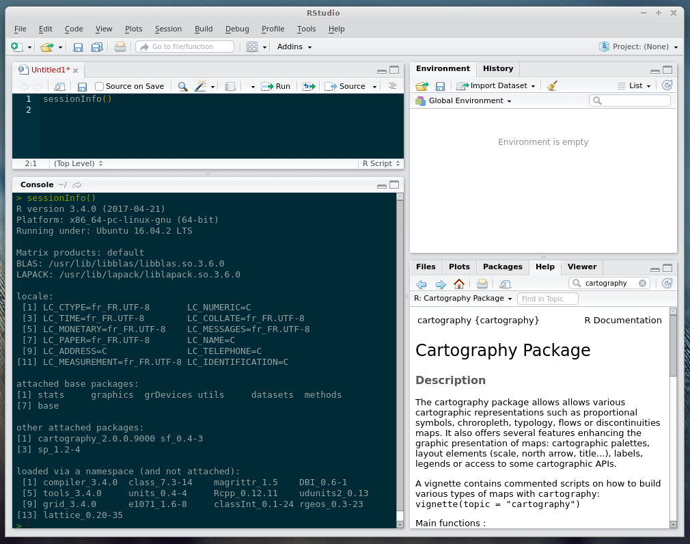
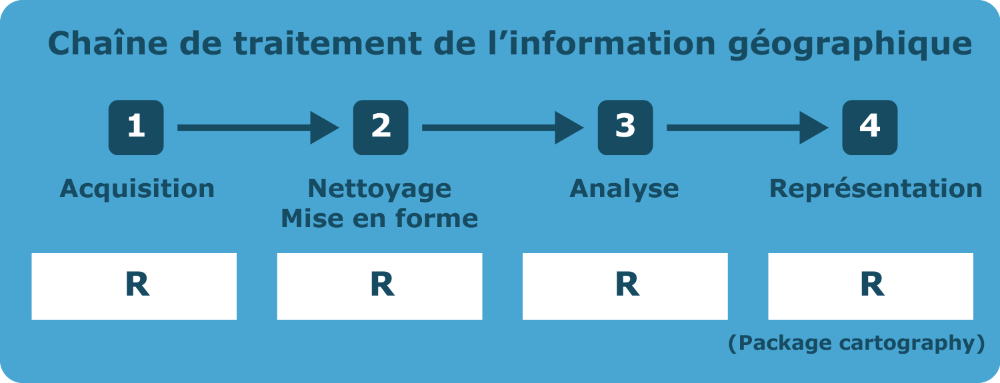
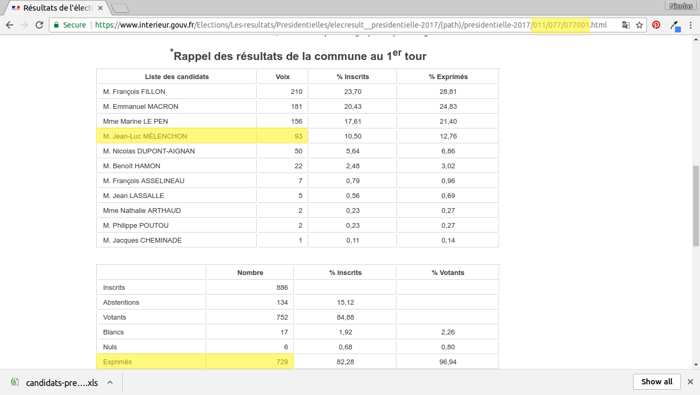
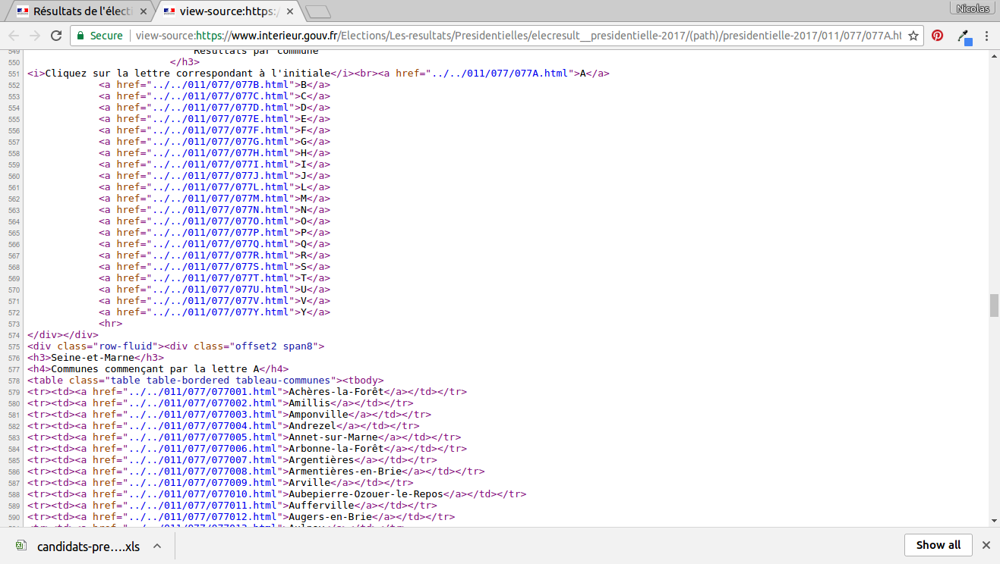

```{r setup, include=FALSE}
knitr::opts_chunk$set(echo = FALSE)
```

# 1. Pourquoi ?

## Qu'est ce que la recherche reproductible ?

**Le principe de la reproductibilité est au fondement même des sciences**

**La reproductibilité est le meilleur test de la validité d'une expérimentation scientifique. "_La science est infaillible ; mais les savants se trompent toujours" (Anatole France, 1889)_**

**[CONSTAT] Par rapport aux sciences experimentales, Les sciences basées sur l'informatique ont l'avantage d'être plus facilement reproductibles.** 

**[OBJECTIF] Accompagner les publications scientifiques des jeux de données et codes sources pour permettre aux  collègues de reproduire les résultats.**

## Intérêt de la recherche reproductible


Peng, 2011


## Et les cartes ?

**Les cartes, comme les autres production graphiques ou statistiques sont des éléments à part entière des études scientifique.**

**La grande majorité des cartes produites dans un contexte académique sont issues de processus comlexes. Elles sont donc souvent produites en utilisant une grande variété de logiciels et de formats.**

**Cette variété de formats et de logiciels rend difficile la reproduction des cartes.**

**=> UN OBJECTIF : simplifier les chaines de traitement**

## Simplifier les chaines de traitement



## Simplifier les chaines de traitement




## Les enjeux de la cartographie reproductible

__Un langage commun permetant de couvrir les différentes étapes de la constructuion cartographique__

- Garder une trace cohérente des traitements effectués  
- Partager ses méthodes  
- Etre transparent, s'exposer à la critique  
- Faciliter les mises à jour  
- Travailler collectivement  
- Automatiser des taches  
- Lier fortement l'analyse et la représentation  

## Cartographie reproductible


# 2. Comment ?


## Quels critères pour choisir les bons outils

- Disponibilité (question du coût des licences)    

- Transparence (open-source, licence d'utilisation)    

- Simplicité d'utilisation (degrès d'adoption de la solution dans la communauté concernée)  


## Un jeu d'outils et de technologies


* **Le logiciel R** 

* **Son écosystème de *packages* **

* **Un environnement de développement intégré (IDE).**   


## Un jeu d'outils et de technologie
\+ 

**=> Des solutions de *literate programming*, tel que le Markdown et le RMardown.**  
 *Literate programming* : Une explication de la logique du programme en langage naturel, entremêlée de morceaux de code source. 


**=> Un logiciel de gestion de version, tel que git et la plateforme d'hébergement Github pour diffuser et partager ses résultats, travailler en équipe ou faire appel à des contributeurs. **   


## R

* R est un langage et un environnement permettant de réaliser une variété de traitements statistiques et de représentations graphiques.

* R est un logiciel libre sous license GNU General Public License.

* R est multiplateforme (GNU/Linux, Windows, OS X...).


## Les packages
**10762 packages** dans le *Comprehensive R Archive Network* (CRAN) (6 juin 2017)

```{r, out.width = "500px"}

```

*CRAN package data through 2016 by Andrie de Vries*

## R Base
```{r, out.width = "500px"}

```


## RStudio (IDE)
```{r, out.width = "500px"}

```


## Simplifier les chaines de traitement


## Simplifier les chaines de traitement




# 3. Le package cartography

## Un jeu de fonctions simples et configurables {.smaller}

- Symboles proportionnels (cercles, carrés, barres, triangles)
- Symboles proportionnels colorés (selon une variable quantitative ou qualitative)
- Cartes choroplèthes
- Liens (proportionnels, colorés, gradués)
- Cartes de discontinuités
- Cartes lissées 
- Cartes en carroyage
- Discrétisations
- Habillage (titre, flèches, échelles)
- Palettes de couleurs
- Légendes
- Etiquettes
- Téléchargement de fond de cartes


## Des représentations classiques... {.smaller}

```{r, echo = TRUE, eval = FALSE}
library(cartography)
data(nuts2006)
nuts2.df$cagr <- (((nuts2.df$pop2008 / nuts2.df$pop1999)^(1/9)) - 1) * 100
choroLayer(spdf = nuts2.spdf, df = nuts2.df, var = "cagr")
```

```{r, echo = FALSE, eval = TRUE}
suppressPackageStartupMessages(library(cartography))
par(mar = c(0,0,0,0))
data(nuts2006)
nuts2.df$cagr <- (((nuts2.df$pop2008 / nuts2.df$pop1999)^(1/9)) - 1) * 100
choroLayer(spdf = nuts2.spdf, df = nuts2.df, var = "cagr")
```


## 
```{r, echo = TRUE, eval = FALSE}
library(cartography)
data(nuts2006)
nuts2.df$cagr <- (((nuts2.df$pop2008 / nuts2.df$pop1999)^(1/9)) - 1) * 100
cols <- carto.pal(pal1 = "green.pal", n1 = 2, pal2 = "red.pal", n2 = 4) 
plot(nuts0.spdf, border = NA, col = NA, bg = "#A6CAE0")
plot(world.spdf, col  = "#E3DEBF", border=NA, add=TRUE)
choroLayer(spdf = nuts2.spdf, df = nuts2.df, 
           var = "cagr", 
           breaks = c(-2.43,-1,0,0.5,1,2,3.1), 
           col = cols, border = "grey40", lwd = 0.5, 
           legend.pos = "right", 
           legend.title.txt = "Compound Annual\nGrowth Rate", 
           legend.values.rnd = 2, add = TRUE) 
plot(nuts0.spdf,border = "grey20", lwd=0.75, add=TRUE)
layoutLayer(title = "Demographic Trends", author = "cartography", 
            sources = "Eurostat, 2008", frame = TRUE, col = NA, 
            scale = NULL, coltitle = "black",
            south = TRUE) 
barscale(size = 400)
```

## 

```{r, echo = FALSE, eval = TRUE, fig.width=5.5, fig.height=5.5, cache=TRUE}
library(cartography)
par(mar = c(0,0,1.2,0))
data(nuts2006)
nuts2.df$cagr <- (((nuts2.df$pop2008 / nuts2.df$pop1999)^(1/9)) - 1) * 100
cols <- carto.pal(pal1 = "green.pal", n1 = 2, pal2 = "red.pal", n2 = 4) 
plot(nuts0.spdf, border = NA, col = NA, bg = "#A6CAE0")
plot(world.spdf, col  = "#E3DEBF", border=NA, add=TRUE)
choroLayer(spdf = nuts2.spdf, df = nuts2.df, 
           var = "cagr", 
           breaks = c(-2.43,-1,0,0.5,1,2,3.1), 
           col = cols, border = "grey40", lwd = 0.5, 
           legend.pos = "right", 
           legend.title.txt = "Compound Annual\nGrowth Rate", 
           legend.values.rnd = 2, add = TRUE) 
plot(nuts0.spdf,border = "grey20", lwd=0.75, add=TRUE)
layoutLayer(title = "Demographic Trends", author = "cartography", 
            sources = "Eurostat, 2008", frame = TRUE, col = NA, 
            scale = NULL, coltitle = "black",
            south = TRUE) 
barscale(size = 400)
```

##

```{r, echo = TRUE, eval = FALSE}
# ...

## Plot Stamen tiles (using OpenStreetMap data) as basemap 
EUosm <- getTiles(spdf = nuts0.spdf, type = "stamenwatercolor", zoom = 4)
# Plot the tiles
tilesLayer(EUosm)

# ...

# Plot countries population 
propSymbolsLayer(spdf = nuts0.spdf, # SpatialPolygonsDataFrame of the countries
                 df = nuts0.df,  # data frame of the regions
                 var = "pop",  # population
                 symbols = "circle", # type of symbol
                 border = "white", # color of the symbols borders
                 lwd = 1.5, # width of the symbols borders
                 legend.pos = "topleft", 
                 legend.title.txt = "Total population\n(in thousands)")
# ...

```

##

```{r, echo = FALSE, eval = TRUE, fig.width=5.5, fig.height=5.5, cache=TRUE, warning=F, message=F}
# set margins
opar <- par(mar = c(0.1,0.1,1.3,0.1))

## Plot Stamen tiles (using OpenStreetMap data) as basemap 
# Download the tiles, nuts0.spdf extent
EUosm <- getTiles(spdf = nuts0.spdf, type = "stamenwatercolor", zoom = 4)
# Plot the tiles
tilesLayer(EUosm)

# Plot countries
plot(nuts0.spdf, border = "grey65", lwd = 2, add=TRUE)

# Plot countries population 
nuts0.df$pop <- nuts0.df$pop2008 / 1000
propSymbolsLayer(spdf = nuts0.spdf, # SpatialPolygonsDataFrame of the countries
                 df = nuts0.df,  # data frame of the regions
                 var = "pop",  # population
                 symbols = "circle", # type of symbol
                 border = "white", # color of the symbols borders
                 lwd = 1.5, # width of the symbols borders
                 legend.pos = "topleft", 
                 legend.title.txt = "Total population\n(in thousands)")
# Layout plot
layoutLayer(title = "Countries Population in Europe",
            sources = "Data: Eurostat, 2008",
            author = "Base map: Map tiles by Stamen Design, under CC BY 3.0. Data by OpenStreetMap, under CC BY SA.",
            scale = NULL, frame = TRUE,
            col = "#688994") # color of the frame
```


##

```{r, echo = TRUE, eval = FALSE}
# ...

# Plot symbols with choropleth coloration
propSymbolsChoroLayer(spdf = nuts2.spdf, 
                      df = nuts2.df, 
                      var = "pop2008", #  field in df to plot the symbols sizes
                      inches = 0.1, # set the symbols sizes
                      var2 = "cagr", #  field in df to plot the colors
                      col = cols, # symbols colors
                      breaks = c(-2.43,-1,0,0.5,1,2,3.1), # breaks
                      border = "grey50",  # border colors of the symbols
                      lwd = 0.75, # symbols width
                      legend.var.pos = "topright", # size legend position
                      legend.var.values.rnd = -3, # size legend value roundinf
                      legend.var.title.txt = "Total Population", # size legend title
                      legend.var.style = "e", # size legend type
                      legend.var2.pos = "right", # color legend position
                      legend.var2.title.txt = "Compound Annual\nGrowth Rate") # legend title

# ...
```

##

```{r, echo = FALSE, eval = TRUE, fig.width=5.5, fig.height=5.5, cache=TRUE}
# set margins
opar <- par(mar = c(0,0,1.2,0))

# Compute the compound annual growth rate
nuts2.df$cagr <- (((nuts2.df$pop2008 / nuts2.df$pop1999)^(1/9)) - 1) * 100

# Plot a layer with the extent of the EU28 countries with only a background color
plot(nuts0.spdf, border = NA, col = NA, bg = "#A6CAE0")
# Plot non european space
plot(world.spdf, col  = "#E3DEBF", border=NA, add=TRUE)
# Plot Nuts2 regions
plot(nuts2.spdf, col = "grey60",border = "white", lwd=0.4, add=TRUE)

# Set a custom color palette
cols <- carto.pal(pal1 = "blue.pal", n1 = 2, pal2 = "red.pal", n2 = 4)

# Plot symbols with choropleth coloration
propSymbolsChoroLayer(spdf = nuts2.spdf, 
                      df = nuts2.df, 
                      var = "pop2008", #  field in df to plot the symbols sizes
                      inches = 0.1, # set the symbols sizes
                      var2 = "cagr", #  field in df to plot the colors
                      col = cols, # symbols colors
                      breaks = c(-2.43,-1,0,0.5,1,2,3.1), # breaks
                      border = "grey50",  # border colors of the symbols
                      lwd = 0.75, # symbols width
                      legend.var.pos = "topright", # size legend position
                      legend.var.values.rnd = -3, # size legend value roundinf
                      legend.var.title.txt = "Total Population", # size legend title
                      legend.var.style = "e", # size legend type
                      legend.var2.pos = "right", # color legend position
                      legend.var2.title.txt = "Compound Annual\nGrowth Rate") # legend title

# layout
layoutLayer(title = "Demographic trends, 1999-2008", coltitle = "black",
            sources = "Eurostat, 2011", scale = NULL,
            author = "cartography", frame ="", col = NA)
```


## ... et des représentations plus complexes

```{r, echo = TRUE, eval = FALSE}
# ...
# Create a grid layer
mygrid <- getGridLayer(spdf=nuts2.spdf, # SpatialPolygonsDataFrame
                       cellsize = 200000) # output cell size, in map units (200 km)

# ...

# Plot the gridded population density
choroLayer(spdf = mygrid$spdf,df = datagrid.df,var = "densitykm", 
           border = "grey80", col = cols, legend.pos = "topright",
           method = "q6", add = TRUE,
           legend.title.txt = "Population Density\n(inhabitant/km²)")
# ...
```

##

```{r, echo = FALSE, eval = TRUE, fig.width=5.5, fig.height=5.5, cache=TRUE}
# Load data
data(nuts2006)
# set margins
opar <- par(mar = c(0,0,1.2,0))
# Create a grid layer
nuts2.spdf@data <- nuts2.df
mygrid <- getGridLayer(x = nuts2.spdf, # SpatialPolygonsDataFrame
                       cellsize = 200000 * 200000, # output cell size, in map units (200 km)
                       var = "pop2008") # variable to adapt to the grid
                       

# Plot dentsity of population
## conversion from square meter to square kilometers
mygrid$densitykm <- mygrid$pop2008 * 1000 * 1000 / mygrid$gridarea

# Plot a layer with the extent of the EU28 countries with only a background color
plot(nuts0.spdf, border = NA, col = NA, bg = "#A6CAE0")
# Plot non european space
plot(world.spdf, col  = "#E3DEBF", border=NA, add=TRUE)

# Set a custom color palette
cols <- carto.pal(pal1 = "wine.pal", n1 = 6)

# Plot the gridded population density
choroLayer(x = mygrid, var = "densitykm", 
           border = "grey80", col = cols, legend.pos = "topright",
           method = "q6", add = TRUE, legend.values.rnd = 1,
           legend.title.txt = "Population Density\n(inhabitant/km²)")

# Layout
layoutLayer(title = "Population Density", coltitle = "black",
            sources = "Eurostat, 2011", scale = NULL, 
            author = "cartography", frame ="", col = NA)
```


##

```{r, echo = TRUE, eval = FALSE}
# ...
# Get a SpatialLinesDataFrame of countries borders
nuts0.contig.spdf <- getBorders(nuts0.spdf)
# ...
# Plot discontinuities
discLayer(spdf = nuts0.contig.spdf, # SpatialLinesDataFrame of borders
          df = nuts0.df, # data frame on countries
          var = "gdpcap", # variable used to compute discontinuties 
          type = "rel", # type of discontinuity measure 
          method="equal", # discretisation of discontinuities
          nclass=4, # number of discontinuities classes
          threshold = 0.5, # representation threshold of discontinuities  
          sizemin = 0.5, # minimum size of discontinuities lines
          sizemax = 6, # maximum size of discontinuities lines
          col="red", # color of the lines
          legend.values.rnd = 1,
          legend.title.txt = "Discontinuities in \nGDP per Capita\n(relative)",
          legend.pos = "topright", 
          add=TRUE)

# ...
```

##

```{r, echo = FALSE, eval = TRUE, fig.width=5.5, fig.height=5.5, cache=TRUE}
opar <- par(mar = c(0,0,1.2,0))

# Load data
data(nuts2006)

# Get a SpatialLinesDataFrame of countries borders
nuts0.contig <- getBorders(spdf = nuts0.spdf)


# Get the GDP per capita
nuts0.df$gdpcap <- nuts0.df$gdppps2008/nuts0.df$pop2008*1000000

# Plot a layer with the extent of the EU28 countries with only a background color
plot(nuts0.spdf, border = NA, col = NA, bg = "#A6CAE0")
# Plot non european space
plot(world.spdf, col  = "#E3DEBF", border=NA, add=TRUE)

# Plot GDP per capita with a choropleth layer
choroLayer(spdf = nuts0.spdf, df = nuts0.df, var = "gdpcap", border = "grey80",
           col = carto.pal(pal1 = "kaki.pal", n1 = 6), method = "quantile",
           nclass = 6, add=TRUE, legend.pos = "right", 
           legend.values.rnd = -2,
           legend.title.txt = "GDP per Capita\n(in euros)")

# Plot discontinuities
discLayer(x = nuts0.contig, # sf of borders
          df = nuts0.df, # data frame on countries
          var = "gdpcap", # variable used to compute discontinuties 
          type = "rel", # type of discontinuity measure 
          method="equal", # discretisation of discontinuities
          nclass=4, # number of discontinuities classes
          threshold = 0.5, # representation threshold of discontinuities  
          sizemin = 0.5, # minimum size of discontinuities lines
          sizemax = 6, # maximum size of discontinuities lines
          col="red", # color of the lines
          legend.values.rnd = 1,
          legend.title.txt = "Discontinuities in \nGDP per Capita\n(relative)",
          legend.pos = "topright", 
          add=TRUE)

# Layout
layoutLayer(title = "Wealth Disparities in Europe", coltitle = "black",
            sources = "Eurostat, 2011", scale = NULL,
            author = "cartography", frame ="", col = NA)
```


## 

```{r, echo = TRUE, eval = FALSE}
# ...

# compute & display the potential map
smoothLayer(spdf = mygrid$spdf, df = df1, var = "gdp", var2 = "pop2008", breaks = v, 
            span = 1e+05, beta = 2, mask = nuts0.spdf, resolution = 49000, col = cols, 
            legend.title.txt = "Potential\nGDP per capita\n(in euros)", legend.values.rnd = -2, 
            border = "grey80", lwd = 0.5, add = T, legend.pos = "topright")

# ...
```


##

```{r, echo = FALSE, eval = TRUE, fig.width=5.5, fig.height=5.5, cache=TRUE, message=FALSE, warning=FALSE }
suppressPackageStartupMessages(library(sf))

# set margins
opar <- par(mar = c(0, 0, 1.2, 0))
# Load data
data(nuts2006)

nuts3.spdf@data = nuts3.df
# Create a grid layer
mygrid <- getGridLayer(x = sf::st_as_sf(nuts3.spdf), cellsize = 50000 * 50000, 
                       type = "regular", 
                       var = c("pop2008", "gdppps2008"))


# Compute data for the grid layer
mygrid$gdp <- mygrid$gdppps2008*1000000

# list of breaks
v <- c(2920, 5000, 10000, 15000, 20000, 23500, 30000, 35000, 40000, 42720)
# Plot a layer with the extent of the EU28 countries with only a background
# color
plot(nuts0.spdf, border = NA, col = NA, bg = "#A6CAE0")

# Plot non european space
plot(world.spdf, col = "#E3DEBF", border = NA, add = TRUE)

# set a color palette
cols <- c(rev(carto.pal("green.pal", 5)), carto.pal("orange.pal", 4))

# compute & display the potential map
smoothLayer(x = mygrid, var = "gdp", var2 = "pop2008", breaks = v, 
            span = 1e+05, beta = 2, mask = nuts0.spdf, resolution = 49000, col = cols, 
            legend.title.txt = "Potential\nGDP per capita\n(in euros)", legend.values.rnd = -2, 
            border = "grey80", lwd = 0.5, add = T, legend.pos = "topright")

# plot Europe contour
plot(rgeos::gBuffer(nuts0.spdf, FALSE, 1), add = T, col = NA, border = "grey50")

# plot a layout
layoutLayer(title = "Wealth Inequalities in Europe, 2008", author = "Package cartography v1.4.0", 
            sources = "Source: Eurostat, 2011", frame = TRUE, scale = 500, north = FALSE, 
            theme = "sand.pal")

# plot a text on the map
text(x = 6271272, y = 3743765, labels = "Distance function:\n- type = exponential\n- beta = 2\n- span = 100 km", 
     cex = 0.8, adj = 0, font = 3)
```


# 4. Exemple d'application

## Analyse du vote en faveur de Jean-Luc Mélenchon en Île-de-France.

* Extraction des données
* Nettoyage et mise en forme
* Analyse
* Cartographie


## Site web du ministrère de l'intérieur



## Derrière la page, des balises, des classes, des styles..



## Webscrapping avec R

```{r eval=FALSE,echo=T}
## Chargement des packages

library(xml2)
library(rvest)

```

* A l'aide des boucles, on 'parse' les lien pour afficher les pages de chaque commune.
* Grace a xml2 et rvet, on accède aux données précises dans la page
* A la fin du processus, on sauvegarde des données dans un fichier csv
* On réalise cette extraction pour les elections de 2012 et celles de 2017

**==> result2017.csv**   
**==> result2012.csv**  

* On peut passer à l'étape suivante... en live

##

<center><h2>Présentation, codes sources et données disponibles ici </h2></center>
<br/>
<center><h2>https://github.com/riatelab/cartostats</h2></center>


# 5. Bonus Magrit 


