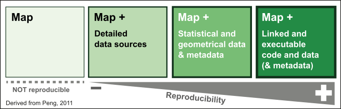

```{r setup, include=FALSE}
knitr::opts_chunk$set(echo = FALSE)
```

# 1. Pourquoi ?

## Qu'est ce que la recherche reproductible ?

**La reproductibilité est le meilleur test de la validité d'une expérimentation scientifique**

**La science est infaillible ; mais les savants se trompent toujours" (Anatole France, 1889)**

**BUT : Accompagner les publications scientifiques des jeux de données et codes sources pour permettre aux  collègues de reproduire les résultats**

## Intérêt de la recherche reproductible

Peng, 2011

## Et les cartes ?

**Les cartes, comme les autres production graphiques ou statistiques sont des éléments à part entière des études scientifique**

**La grande majorité des cartes produites dans un contexte académique actuellement sont produite en utilisant une grande variété de logiciel et de formats**

**Cette variété de formats et de logiciel rend difficile la reproduction des cartes**

## Les enjeux de la cartographie reproductible

- Garder une trace des traitements effectuer
- Partager ses méthodes
- Etre transparent, s'exposer à la critique
- Faciliter les mises à jour
- Travailler collectivement
- Automatisation des taches
- Lier fortement l'analyse et la représentation

## Cartographie reproductible



## Quels objectifs et quels critères pour choisir les bons outils

- Disponibilité (question du coût des licences)    

- Transparence (open-source, licence d'utilisation)    

- Simplicité d'utilisation (degrès d'adoption de la solution dans la communauté concernée)  

## Un jeu d'outils et de technologies

- Pouvoir mettre en oeuvre un grand nombre de traitements, de méthodes et de représentations stat/spatials dans un même environnement.  
**==> Le logiciel R, son ecosystème de package et un IDE.**   

- Pouvoir présenter ses résultats de manière à permettre leur reproduction   
**==> Des solutions de *literate programming*, tel que le markdown et le RMardown.**   
- Diffuser et partager ses résultats, éventuellement travailler en équipe ou faire appel à des contributeurs.   
**==> Un logiciel de gestion de version, tel que git et la plateforme d'hébergement Github basé sur celui-ci.**   

## Simplifier les chaines de traitement


## Simplifier les chaines de traitement


## Simplifier les chaines de traitement


### R et son ecosystème
### Le literate programming
### Les logiciels de gestion de version

# 3. Le package cartography
## Un jeu de fonctions simples et configurables
## Des représentations classiques...
## ... et des représentations plus complexes


# 4. Exemple d'application

## Analyse du vote en faveur de Jean-Luc Mélenchon en Île-de-France.

* Extraction des données
* Nettoyage et mise en forme
* Analyse
* Cartographie

## Extraction des données électorales

### __METHODE : __ Webscrapping 

### __PREREQUIS : __ HTML, Expressions regulières

### __PAQUAGES : __ xml2, rvest

## Naviguer de pages en pages...


## Naviguer de pages en pages...


## Naviguer de pages en pages...


## ... jusqu'à atteindre le bon tableau


## ... jusqu'à atteindre le bon tableau


## S'appuyer sur les balises, styles, classes, etc...


## Dans R

```{r eval=FALSE,echo=T}
## Chargement des packages

library(xml2)
library(rvest)

# Liens des pages à lire
site <- "http://elections.interieur.gouv.fr/presidentielle-2017/011"
departements <- c("075","077","078","091","092","093","094","095")

```

## Dans R

```{r eval=FALSE,echo=T}

dep <- departements[1]
page <- paste(dep,"html",sep=".")
url <- paste (site,dep,page,sep="/")
webpage <- read_html(x = url)
l <- webpage %>% html_nodes(".offset2") %>% html_nodes("a") %>%  html_attr("href")
l <- gsub("../../011/075/", "", l)
l <- paste(dep,l,sep="/")
links <- l
links

```

 [1] "075/075056AR01.html" "075/075056AR02.html" "075/075056AR03.html" "075/075056AR04.html"
 [5] "075/075056AR05.html" "075/075056AR06.html" "075/075056AR07.html" "075/075056AR08.html"
 [9] "075/075056AR09.html" "075/075056AR10.html" "075/075056AR11.html" "075/075056AR12.html"
[13] "075/075056AR13.html" "075/075056AR14.html" "075/075056AR15.html" "075/075056AR16.html"
[17] "075/075056AR17.html" "075/075056AR18.html" "075/075056AR19.html" "075/075056AR20.html"

## Dans R

* A l'aide d'une boucle, va sur chaque lien obvtenu jusqu'à obtenir les tableaux de données.
* A la fin du processus, on sauvegarde des données dans un fichier csv contenant tous les resultats du vote pour toutes les communes d'Île-de-France
* On réalise cette extraction pour les elections de 2012 et celles de 2017

**==> result2017.csv**   
**==> result2012.csv**  

* On peut passer à l'étape suivante.

## Live demo


# 5. Bonus Magrit 


